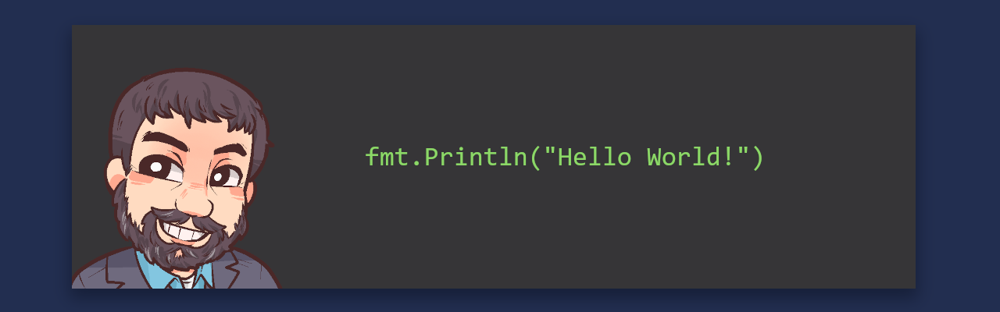

**Hello, I'm Tony 👋**

I’m a Senior Infrastructure Engineer and US Army Veteran focused on building secure, automated, and resilient systems. I specialize in enterprise-grade Linux environments and systems programming.

**🛠 Tech Stack & Expertise**

- Enterprise Linux (RHEL/Alma/Rocky), VMware/Proxmox, Docker/Podman
- Infrastructure-as-Code, CI/CD, Automation.
- PKI (Public Key Infrastructure), Cryptography
- Go (Golang), Shell Scripting

**🚀 Latest Project**

GopherFetch – A lightweight, high-performance system information and file retrieval utility written in Go.

**🤝 Connect & Verify**

- **LinkedIn:** [linkedin.com/in/cavella](https://www.linkedin.com/in/cavella/)

- **Security:** [Public PGP Key](https://keys.openpgp.org/vks/v1/by-fingerprint/D55208250F6C78D9BE5778E220C3B7A79E8466F0)

   - _Fingerprint:_ `D552 0825 0F6C 78D9 BE57 78E2 20C3 B7A7 9E84 66F0`

**🌲 Beyond the Terminal**

When I'm not architecting infrastructure or coding in Go, you’ll likely find me:
- Expanding my homelab.
- Working around the house.
- Or out on the water.
