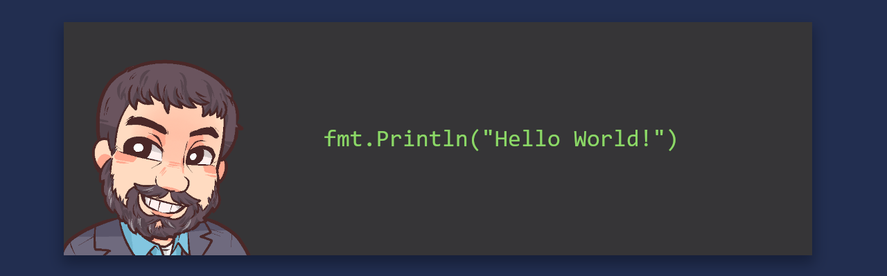

I'm Tony, a senior infrastructure engineer by day. I live and breath enterprise linux, am a devops/automation enthusiast, a lifelong PKI student and homelab hacker. I am passionate about everything that is technology/open-source and am on a mission to constantly learn new things. 

## 🗨️ Social Media

## 💻 Technology Stack

\

